<picture>
  <source media="(prefers-color-scheme: dark)" srcset="assets/header-dark.svg">
  <source media="(prefers-color-scheme: light)" srcset="assets/header-light.svg">
  
</picture>

Full-stack developer working mostly in **TypeScript**: Next.js and React on the front, Node/Express and Supabase/Postgres or MongoDB behind it, deployed on Vercel and Cloudflare. I like shipping things people can actually open and use, and I contribute fixes to open-source projects I learn from.

**Portfolio:** [jeevan2410.github.io/Portfolio](https://jeevan2410.github.io/Portfolio/)

## Open-source contributions

Merged:

- **[libredb/libredb-studio#1522](https://github.com/libredb/libredb-studio/pull/1522)**: MongoDB whole-database Validate and Compact no longer crash on views; time series collections are handled and per-collection failures are reported (verified on MongoDB 7.0, 8.0 and 8.2).
- **[libredb/libredb-studio#1554](https://github.com/libredb/libredb-studio/pull/1554)**: MongoDB schema inference and the data profiler count fields missing from some documents as nullable.
- **[libredb/libredb-studio#1556](https://github.com/libredb/libredb-studio/pull/1556)**: Monitoring labels a Percona Server correctly instead of calling it MySQL.
- **[libredb/libredb-studio#1561](https://github.com/libredb/libredb-studio/pull/1561)**: running a selected statement in the editor drops its trailing terminator on engines that take none, such as Oracle and Elasticsearch.
- **[libredb/libredb-studio#1562](https://github.com/libredb/libredb-studio/pull/1562)**: LibreDB connections refuse `:memory:` and name a missing directory clearly.
- **[lingui/js-lingui#2703](https://github.com/lingui/js-lingui/pull/2703)**: the Vite plugin's native macro transform no longer fails on module ids with a query string (React Router framework mode).

In review: [libredb#1571](https://github.com/libredb/libredb-studio/pull/1571), [reticle#1402](https://github.com/reticlehq/reticle/pull/1402), [corsair#1847](https://github.com/corsairdev/corsair/pull/1847).

## Projects

| Project | What it is | Stack |
|---|---|---|
| **[AdikeCast](https://github.com/Jeevan2410/price-forecasting)** · [live](https://adikecast.vercel.app) | Weekly arecanut price forecasts for Dakshina Kannada markets, turned into a plain Sell / Hold signal for farmers, in English and Kannada, with a free JSON API | Next.js 16, TypeScript, Zod |
| **[QuoteFlow](https://github.com/Jeevan2410/projrc)** | Quote-to-cash SaaS for small service businesses: enquiries, quotes, jobs and follow-ups | Next.js 16, TypeScript, Cloudflare Workers |
| **[CineGen API](https://github.com/Jeevan2410/CineGen-API)** | Backend for AI video and image generation: JWT auth and roles, credits, async jobs via queue, signed webhooks and a fallback poller | Node.js, Express, MongoDB, Cloudinary |
| **[Tiny Planet: Shrines of the Blight](https://github.com/Jeevan2410/Tiny-Planet-Action-RPG)** · [play](https://tiny-planet-action-rpg.vercel.app) | A 3D action-RPG on a tiny round world, with quests, gear, saves and a synthesised audio engine | Three.js, TypeScript, Vite, IndexedDB |
| **[Tiny Planet Courier](https://github.com/Jeevan2410/Tiny-Planet-Courier)** · [play](https://tiny-planet-courier.vercel.app) | Multiplayer browser delivery game with other players in real time | Three.js, Supabase Realtime |
| **[BookNest](https://github.com/Jeevan2410/BookNest)** · [live](https://book-nest-lemon-eight.vercel.app) | A bookstore and book-box subscription site: browse by genre, build a box, gifts, membership, accounts and checkout | React, Supabase, Framer Motion |
| **[achievement-tracker](https://github.com/Jeevan2410/achievement-tracker)** | CLI that shows progress toward GitHub achievement tiers | TypeScript, GitHub REST and GraphQL |

College side projects, rebuilt with today's code and motion: **[Weather](https://github.com/Jeevan2410/WeatherApp)** · [live](https://weather-app-lac-iota-59.vercel.app) (animated sky, Open-Meteo, canvas rain and snow), **[Calculator](https://github.com/Jeevan2410/Calculator)** · [live](https://calculator-six-iota-56.vercel.app) (safe parser instead of `eval`, history, 3D tilt), **[Reelhouse](https://github.com/Jeevan2410/Netflix-Clone)** · [live](https://jeevan2410.github.io/Netflix-Clone/) (TV show browser on TVmaze, View Transitions), **[Halcyon One](https://github.com/Jeevan2410/Landing-Page)** · [live](https://jeevan2410.github.io/Landing-Page/) (3D smartwatch in Three.js that turns as you scroll) and **[To-do](https://github.com/Jeevan2410/TO-DO-LIST)** · [live](https://jeevan2410.github.io/TO-DO-LIST/) (drag to reorder, undo, FLIP animations).

## Tools I use

TypeScript · JavaScript · React · Next.js · Astro · Node.js · Express · Supabase · PostgreSQL · MongoDB · Tailwind CSS · Three.js · Vercel · Cloudflare

## Open to

Freelance projects and junior / internship roles in full-stack web development.

<picture>
  <source media="(prefers-color-scheme: dark)" srcset="assets/footer-dark.svg">
  <source media="(prefers-color-scheme: light)" srcset="assets/footer-light.svg">
  
</picture>
